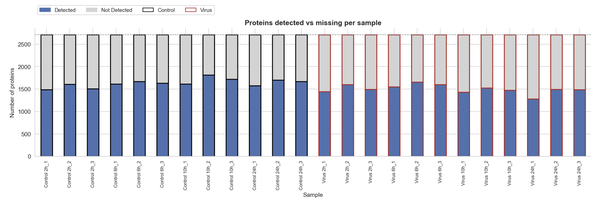
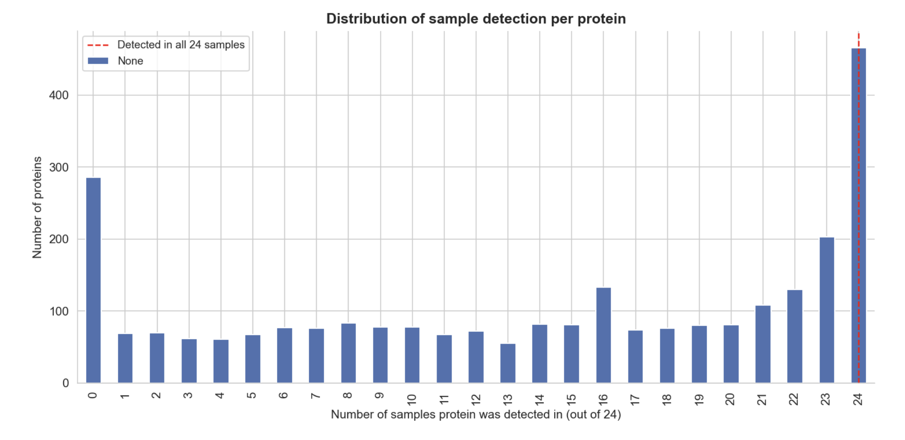
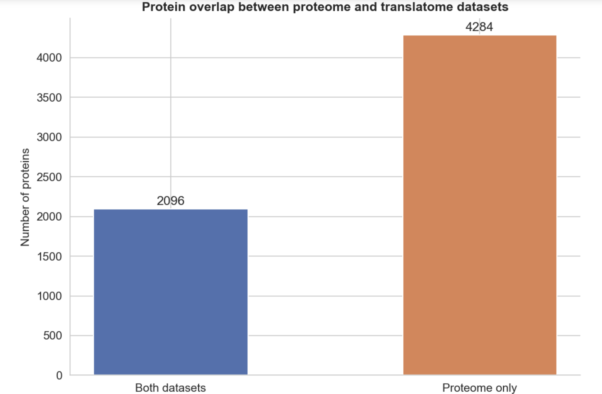
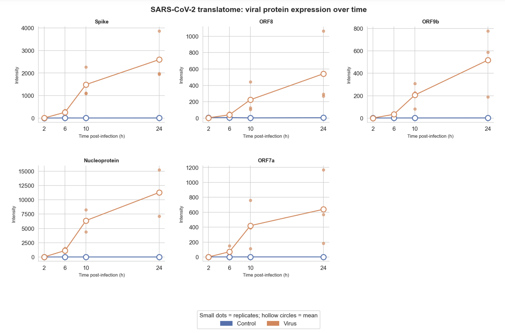
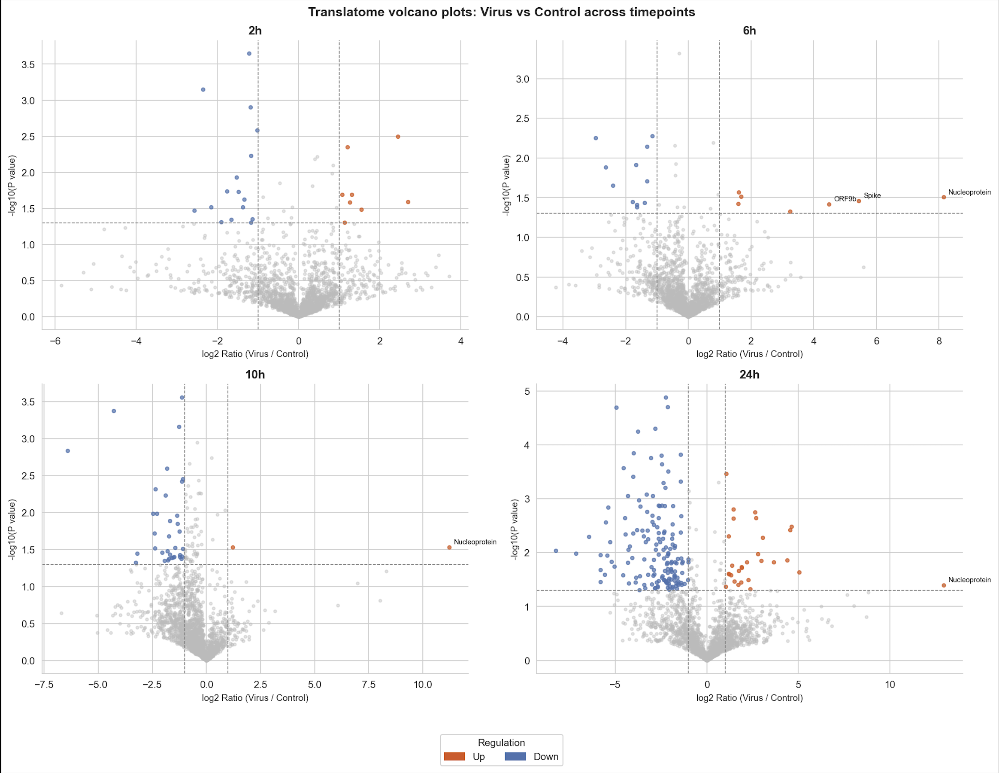

# 🧬 Proteome and Translatome Analysis of SARS-CoV-2 Infection

This repository contains my bioinformatics project for analysing **proteome** and **translatome** responses during **SARS-CoV-2 infection**. The project combines protein detection analysis, missing-value exploration, dataset overlap comparison, viral protein expression profiling, and differential expression analysis to better understand how infection changes host and viral protein activity over time.

---

## 📌 Introduction

This project investigates how SARS-CoV-2 infection affects protein expression at two molecular levels:

- the **proteome**, which measures the total pool of proteins present in the cell
- the **translatome**, which measures newly synthesised proteins being actively translated

By comparing these two datasets across multiple post-infection timepoints, the analysis shows how viral proteins emerge over time, how host protein translation changes during infection, and how translational responses relate to accumulated protein abundance.

This project demonstrates practical skills in:

- bioinformatics data analysis
- missing-value exploration
- dataset overlap analysis
- protein expression profiling
- differential expression analysis
- volcano plot interpretation
- proteome vs translatome comparison
- data visualisation in Python

---

## 💡 Motivation

Proteomics and translatomics provide complementary views of infection biology.

The **proteome** captures all proteins present in the cell, including stable proteins that may have accumulated over time. In contrast, the **translatome** captures proteins that are actively being synthesised at a particular moment. Comparing the two helps reveal not only which proteins are present, but also which ones are currently being produced in response to infection.

The goal of this project is to better understand:

- how much missingness exists in the translatome data
- how many proteins are shared between proteome and translatome datasets
- which SARS-CoV-2 proteins become strongly expressed over time
- how host proteins are up-regulated or down-regulated during infection
- how strongly proteome and translatome fold changes agree across timepoints

---

## 📂 Dataset Description

This project analyses matched **control** and **virus-infected** samples across four timepoints:

- **2h**
- **6h**
- **10h**
- **24h**

Each timepoint includes biological replicates for both control and virus conditions.

The workflow uses:

- a **translatome dataset** containing newly synthesised proteins
- a **proteome dataset** from the earlier analysis for comparison

According to the notebook discussion, the translatome dataset contains **2,715 quantified proteins** before later filtering, compared with roughly **6,380 proteins** in the proteome, reflecting the fact that the translatome measures only actively translated proteins rather than the full accumulated protein pool. 

---

## 🔍 Main Analysis Sections

### 1. Protein detection and missingness

The first part of the project examines how many proteins are detected in each sample and how much missingness is present across the translatome dataset.

The notebook found that each sample detected roughly **1,279 to 1,816 proteins** out of **2,715**, with approximately **33–53% missing values per sample**. Virus samples at **24h** showed the fewest detected proteins and the highest missingness, suggesting either stronger biological disruption or lower detectability late in infection. 

### 2. Dataset size and overlap

The second part compares the translatome with the proteome dataset.

After imputation and matching, the notebook reports that the translatome contains **2,099 proteins**, with **2,096 proteins shared** between both datasets and **4,284 proteins found only in the proteome**. No proteins were unique to the translatome after matching, which supports the biological expectation that actively translated proteins should also be present in the total protein pool. 

### 3. Viral protein expression profiles

The third part focuses on SARS-CoV-2 proteins detected in the translatome.

Only **5 of 17 annotated viral proteins** were detected in the translatome: **Spike, ORF8, ORF9b, Nucleoprotein, and ORF7a**. All showed near-zero values in control samples and rising expression in virus samples from early timepoints onward, with **Nucleoprotein** becoming the most abundant by 24h. 

### 4. Differential expression across timepoints

The project then calculates **log2 fold changes** and **Welch’s t-test p-values** for each timepoint to identify significantly regulated proteins.

Using thresholds of **log2 ratio ≥ 1 or ≤ −1** and **p < 0.05**, the notebook reports the following counts of significantly regulated **human proteins**:

| Timepoint | Up | Down |
|-----------|----|------|
| 2h        | 8  | 16   |
| 6h        | 4  | 11   |
| 10h       | 1  | 35   |
| 24h       | 28 | 156  |

This shows that the strongest host response appears at **24h**, with a particularly large number of down-regulated proteins. 

### 5. Correlation between proteome and translatome

Finally, the project compares fold changes in the proteome and translatome datasets.

Across all shared proteins, Pearson correlations were **positive but moderate**, ranging from **0.281** at 2h to **0.459** at 10h. This supports the idea that translation changes contribute substantially to later protein accumulation, although the relationship is not perfect because protein levels are also influenced by degradation and turnover. 

---

## 📊 Key Visualisations

### 1. Proteins detected vs missing per sample



This stacked bar chart compares detected and missing proteins across all control and virus samples. The figure shows consistently high missingness across the dataset, while also revealing that several virus samples, especially at later timepoints, have fewer detected proteins than their control counterparts. This supports the notebook’s conclusion that the translatome data contains substantial missingness and that late virus samples show the strongest reduction in protein detection. 

### 2. Distribution of sample detection per protein



This plot shows how many proteins were detected in 0 to 24 samples. Two strong peaks appear at the extremes: a large group of proteins detected in **none** of the samples and another large group detected in **all 24** samples. The notebook highlights this as an important signature of heavy missingness, while also showing that many proteins are consistently present across the full experiment. 

### 3. Protein overlap between proteome and translatome datasets



This bar chart summarises the overlap between the two molecular datasets. The shared set of **2,096 proteins** confirms that the translatome is largely a subset of the broader proteome, while the **4,284 proteome-only proteins** represent proteins present in the cell but not actively synthesised at the measured timepoints. 

### 4. SARS-CoV-2 translatome: viral protein expression over time



These line plots show viral protein expression in control and infected samples over time. All five detected viral proteins remain near zero in controls but rise steadily in infected samples, especially from **6h onward**. The notebook identifies **Nucleoprotein** as the most abundant viral protein by **24h**, followed by Spike, ORF7a, ORF8, and ORF9b. 

### 5. Translatome volcano plots: Virus vs Control across timepoints



These volcano plots show how host and viral proteins change between virus and control conditions at each timepoint. The strongest response appears at **24h**, where the notebook reports **156 significantly down-regulated** and **28 significantly up-regulated human proteins**. The plots also show that translational regulation emerges earlier than the proteome response, with detectable significant changes already present at **2h**. 

---

## 🧪 Tools and Libraries Used

This project was built using:

- **Python**
- **Pandas**
- **NumPy**
- **Matplotlib**
- **Seaborn**
- **SciPy**

Main analysis techniques include:

- protein detection and missingness profiling
- overlap comparison between omics datasets
- log2 fold-change calculation
- Welch’s t-test
- volcano plot analysis
- time-course expression analysis
- Pearson correlation analysis

The notebook explicitly uses **Welch’s t-test** because it does not assume equal variance between groups, which is more appropriate for biological data. 

---

## 📈 Main Insights

The project reveals several important findings:

- the translatome contains far fewer proteins than the proteome because it measures only **newly synthesised proteins** rather than the full accumulated protein pool 
- the translatome dataset shows **substantial missingness**, with strong peaks for proteins detected in **0** or **24** samples 
- all matched translatome proteins were also present in the proteome, supporting biological consistency between the datasets 
- **Nucleoprotein** is the strongest viral signal by 24h, while all detected viral proteins rise clearly over time in infected samples only 
- translational responses appear **earlier** than proteome changes, with significant regulation already visible at **2h** in the translatome data 
- the strongest host response occurs at **24h**, dominated by large-scale down-regulation of human proteins 
- proteome and translatome fold changes show a **moderate positive correlation**, suggesting that translation is a major driver of later protein abundance changes, but not the only one 

---

## 📁 Files

- `Working_notebook_week11(2).ipynb` — main notebook containing the full translatome and proteome comparison workflow
- `Screenshot 2026-07-18 at 12.16.32 am.png` — proteins detected vs missing per sample
- `Screenshot 2026-07-18 at 12.16.48 am.png` — distribution of sample detection per protein
- `Screenshot 2026-07-18 at 12.17.13 am.png` — overlap between proteome and translatome datasets
- `Screenshot 2026-07-18 at 12.17.29 am.png` — viral protein expression over time
- `Screenshot 2026-07-18 at 12.18.49 am.png` — translatome volcano plots across timepoints
- `README.md` — project summary and usage instructions

---

## ▶️ How to Run the Project

1. Open the notebook in **Jupyter Notebook**, **JupyterLab**, or **VS Code**
2. Make sure the required proteome and translatome data files are stored in the correct working directory
3. Install the required libraries if needed:

```bash
pip install pandas numpy matplotlib seaborn scipy
